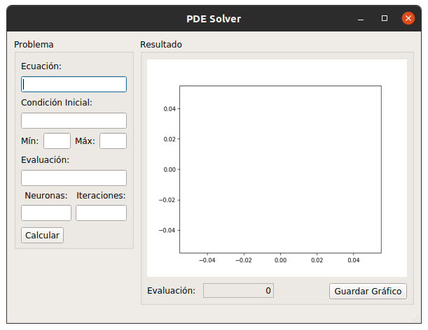
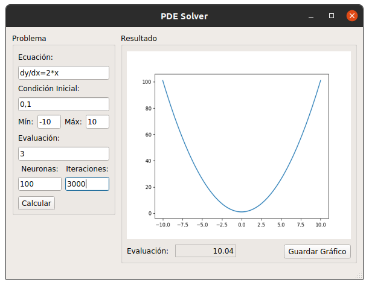

# DE Solver

A partir de una red neuronal con una capa oculta de n neuronas, aproxima la solución de una ecuación diferencial de la forma dy/dx=f(x), devolviendo la evaluación de la solución resultante en un punto y mostrando un gráfico de la solución.

Se utilizó como lenguaje de programación el lenguaje python, en la distribución de **Anaconda 3.7**.

La red neuronal fue implementada con el módulo [pytorch](https://pytorch.org/). Utilizando como función de activación para cada neurona la función `torch.functional.ReLU`.

La interfaz fue realizada con el módulo [PyQt5](https://github.com/PyQt5). Una interfaz sencilla e intuitiva.

